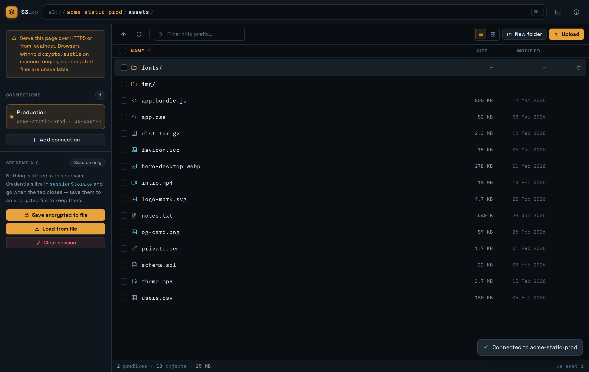

# S3Feather

An S3 browser that runs entirely in your browser. No server, no install, no build step — two files, open one of them and start browsing.  

Live: [try it now!](https://wespeakenglish.github.io/S3Feather/) 



---

## Features

- **The `s3://` address bar** — breadcrumbs when idle, an editable key prefix when focused. Type any `bucket/prefix/` and press Enter to jump straight there.
- **Command palette** — `⌘K` / `Ctrl K` to jump to a prefix, switch bucket, or run any command
- **Keyboard-first** — move, open, select, upload, filter and delete without touching the mouse
- **Multi-bucket** — save several connections and switch with one click
- **S3-compatible** — AWS S3, MinIO, Cloudflare R2, Wasabi, DigitalOcean Spaces, Backblaze B2, Storj, and any S3-compatible endpoint
- **File operations** — upload with per-file progress, download, delete one or many with progress you can stop
- **List and grid views** — grid shows real image thumbnails
- **Presigned share links** — temporary download URLs, 5 minutes to 7 days
- **Drag and drop** — drop files anywhere on the window to upload into the current prefix
- **Sort and filter** — by name, size or date; live filter across every page loaded for the prefix
- **Paged listings** — prefixes larger than S3's 1,000-entry page load on demand; sorting and filtering cover every page loaded, and drawing stays capped so a 25,000-object prefix does not freeze the tab
- **Encrypted credential files** — save your connections to a passphrase-protected `.s3vault` file and load them on any machine
- **Nothing stored in the browser** — credentials live in `sessionStorage` for the tab; `localStorage` is never touched
- **No build step** — plain HTML, CSS and JavaScript; nothing to compile or install

---

## Quick start

1. Put `index.html` and `styles.css` in the same folder and open `index.html` in any modern browser
2. Click **Add connection** in the sidebar
3. Enter your access key, secret and bucket name, then click **Connect**

Already have a `.s3vault` file from an earlier session? Click **Load from file** instead.

> **Serve over HTTPS if you host it.** Opening the files straight off disk (`file://`) or from `localhost` is fine — browsers count both as secure contexts, so the encrypted save and load work there. On a plain-`http://` origin served to others, `crypto.subtle` may be withheld and those features switch off; everything else still works. The sidebar says which situation you are in, and only calls it a problem when the crypto is actually missing.

---

## The address bar

S3 has no folders. A "folder" is just a set of keys that share a prefix, and the bar at the top is that prefix rather than a pretend directory tree.

- Click any segment to jump up to it
- Click the bar, or press `⌘L` / `Ctrl L`, to edit the raw path — the whole path is selected, so typing replaces it
- Paste a full `s3://bucket/prefix/` URI and it will be parsed
- Name a **different** bucket and S3Exp switches to the matching saved connection. If no connection has that bucket, it says so rather than navigating nowhere.

---

## Keyboard shortcuts

| Shortcut | Action |
|---|---|
| `⌘K` / `Ctrl K` | Command palette |
| `⌘L` / `Ctrl L` | Edit the address bar |
| `↑` `↓` | Move through objects |
| `Home` / `End` | First / last object |
| `Enter` or `→` | Open a prefix, or download a file |
| `Backspace` or `←` | Up one prefix |
| `Space` | Select the object under the cursor |
| `⌘A` / `Ctrl A` | Select everything in view |
| `/` | Focus the filter |
| `R` | Refresh |
| `M` | Fetch the next 1,000 objects from the bucket, when the listing is partial |
| `[` / `]` | Previous / next page of drawn rows |
| `G` | Toggle list / grid view |
| `H` | Toggle hiding placeholder files |
| `Delete` | Delete the selection |
| `Escape` | Stop a running upload or delete, then close a dialog, then close the sidebar drawer, then leave the address bar, then clear the filter, then clear the selection |

Typing shortcuts are ignored while a text field has focus. Mouse selection also supports shift-click for a range and `⌘`/`Ctrl`-click to toggle one item.

---

## Narrow screens

Below 900px the sidebar stops being a column and becomes a drawer over the listing:

- The **☰** button in the header opens it; the same button, a tap on the dimmed area beside it, or `Escape` closes it
- Picking a connection closes it for you, since the point of opening it was to reach the listing behind it
- Opening a dialog or the command palette closes it too, so nothing stacks on top of it

The listing sheds columns as space runs out rather than squeezing them: the filter box moves to its own row and **Modified** drops below 760px, **Size** below 560px, and the endpoint leaves the status bar below 480px. Row actions and grid checkboxes are hover-revealed on a pointer device and always visible on a touch one.

---

## Saving credentials to an encrypted file

**Save encrypted to file** writes your connections to a `.s3vault` file:

- **AES-256-GCM**, with the key derived from your passphrase by **PBKDF2-HMAC-SHA256 at 310,000 iterations**
- A random 16-byte salt and a fresh random IV on every save
- The key-derivation header is authenticated as GCM additional data, so editing the stored salt or lowering the iteration count causes a decryption failure rather than a quietly weakened key
- Keys, secrets, bucket names, labels and endpoints all sit **inside** the ciphertext — the file leaks nothing about what it holds
- Minimum passphrase length is 10 characters. The passphrase is never stored and **there is no recovery** — lose it and the file is scrap.

**Load from file** decrypts in memory and either adds the file's connections to your current list (skipping exact duplicates) or replaces the list. A wrong passphrase or an edited file fails to decrypt rather than loading anything.

The file gets its own passphrase, independent of anything else, so it is safe to keep as a backup or carry between machines.

---

## CORS configuration

A browser cannot read a bucket that does not allow it. In the AWS console under **S3 → your bucket → Permissions → Cross-origin resource sharing (CORS)**:

```json
[
  {
    "AllowedHeaders": ["*"],
    "AllowedMethods": ["GET", "PUT", "POST", "DELETE", "HEAD"],
    "AllowedOrigins": ["*"],
    "ExposeHeaders": ["ETag"]
  }
]
```

Once it works, narrow `AllowedOrigins` to the exact origin you serve the file from.

---

## Minimum IAM permissions

```json
{
  "Version": "2012-10-17",
  "Statement": [
    {
      "Effect": "Allow",
      "Action": [
        "s3:ListBucket",
        "s3:GetObject",
        "s3:PutObject",
        "s3:DeleteObject"
      ],
      "Resource": [
        "arn:aws:s3:::your-bucket-name",
        "arn:aws:s3:::your-bucket-name/*"
      ]
    }
  ]
}
```

---

## Connections

Each saved connection stores:

| Field | Description |
|---|---|
| Name | A friendly label, e.g. "Production". Defaults to the bucket name. |
| Access key ID | Your access key |
| Secret access key | Your secret key |
| Bucket | The bucket to browse |
| Region | e.g. `us-east-1`. Leave blank for `us-east-1`. |
| Endpoint | Optional — set it for non-AWS providers |

Connections last for the browser session. Click any entry in the sidebar to switch buckets, or click **✕** to remove it — the ✕ appears on hover, and stays visible on touch devices where there is no hover to rely on. Removing the active connection falls back to the next one.

Each row shows the name on top and the endpoint host (or the region) underneath. When the name is just the bucket name — the default — the bucket is not repeated below it; a name you chose yourself shows `bucket · host`. Anything too long for the row is truncated with an ellipsis, and the full text is in the row's tooltip.

---

## S3-compatible services

| Service | Endpoint format |
|---|---|
| Cloudflare R2 | `https://<account-id>.r2.cloudflarestorage.com` |
| MinIO | `http://your-minio-host:9000` |
| Wasabi | `https://s3.<region>.wasabisys.com` |
| DigitalOcean Spaces | `https://<region>.digitaloceanspaces.com` |
| Backblaze B2 | `https://s3.<region>.backblazeb2.com` |
| Storj | `https://gateway.storjshare.io` |

Enter the URL in the **Endpoint** field. Path-style requests and Signature V4 are used automatically.

> **Mixed content:** if you serve S3Exp over HTTPS, the endpoint must be HTTPS too. A browser blocks `http://` requests from an `https://` page, so a plain-HTTP MinIO host only works when S3Exp itself is on `http://localhost`.

---

## Limits and behaviour worth knowing

- **Large prefixes arrive a page at a time.** S3 answers a listing with at most 1,000 entries, so a bigger prefix loads in pages. The status bar shows *Partial listing — 2,001 loaded* with a **load next 1,000** link beside it, and the same action sits at the foot of the list, in the command palette, and on the `M` key — the status bar is the one part always on screen, so you never have to scroll a thousand rows to find the control. Each click costs the same no matter how much is already loaded.
- **At most 2,000 rows are drawn at once, and you page through the rest.** There is no virtual scroller here — every row is real DOM — and drawing 25,000 of them means a 22 MB HTML string and a list a kilometre tall, where the layout pass alone takes tens of seconds and every sort freezes the tab. So the drawn window is capped and the footer moves it: *Rows 2,001–4,000 of 8,999 · page 2 of 5*, with `[` and `]` on the keyboard. Turning a page is instant, since those rows are already in hand.
- **Two kinds of paging, deliberately worded apart.** **←** and **→** move through rows already loaded; **Fetch next 1,000 from the bucket** is a request to S3. The status bar counts everything loaded, not just what is on screen.
- **The filter and the sort see every loaded page**, not just the drawn window, and the window is sliced after sorting — so sorting by date and reading page 1 is a real answer, and filtering for a key at position 24,999 finds it. Changing the sort or the filter returns you to page 1, because the old page number would no longer mean anything.
- **Select all covers the drawn rows**, not the whole prefix. Deleting a *folder* is different: that enumerates every page itself, so it does not miss anything.
- **Deleting many objects shows progress and can be stopped.** A delete of more than one object, or of any folder, opens a progress dialog with two phases: walking the prefixes to find what is there — counting up, since no total is known yet, and nothing has been deleted at that point — and then the batched deletes, which fill a bar in steps of 1,000 and name the batch in flight (*Batch 3 of 9*). The dialog yields a frame between steps, so the progress is actually painted rather than collapsing into a single jump at the end on a fast connection. **Stop** takes effect at the next batch boundary; the dialog then reports how many were removed, because those are gone and cannot be brought back. A single object still deletes with just a toast.
- **Deleting a folder deletes everything inside it.** Removing `logs/` recursively deletes every object stored under that prefix, including nested folders — the same as Cyberduck, Transmit, or the AWS Console. This can mean a lot of objects behind one confirmation, so double-check the prefix before confirming.
- **Placeholder files are hidden by default.** Zero-byte marker files that other tools drop into a prefix to keep it visible — `.file_placeholder`, `.keep`, `.gitkeep`, `.s3keep`, `.bzEmpty`, `.placeholder`, `.dir`, `.emptyfolderplaceholder` — are hidden from the listing automatically. They still exist in the bucket; toggle them back on with the eye icon in the toolbar, the `H` key, the command palette, or the link in the status bar. Object counts and total size in the status bar reflect only what's currently visible.
- **New folder** writes a zero-byte object whose key ends in `/`, which is how a prefix becomes visible in listings.
- **Cancelling an upload** stops the queue; it does not undo transfers that already finished. Files uploaded before you clicked **Cancel** stay in the bucket, a file interrupted mid-transfer is not written, and the dialog reports how many of the batch made it.
- **Multiple downloads** are started one at a time with a short pause. Your browser may still ask permission for more than a few.
- **Link lifetimes:** download links are signed for 60 seconds, grid thumbnails for 15 minutes, and share links for whatever you pick in the dialog.

---

## Security notes

- Credentials are held **only in `sessionStorage`**, never in `localStorage`, cookies, or on disk.
- `sessionStorage` is scoped to the tab. **Closing the tab clears it; reloading the page does not** — the connections come back after a refresh, which is deliberate. Use **Clear session** to wipe them immediately.
- Presigned URLs are generated locally by the AWS SDK and pass through no third-party server.
- Scope credentials to a single bucket with the four actions listed above, and rotate them.

Encryption at rest is not the same as safety while running:

- While you are connected, the plaintext keys are in page memory. Anything running in this page can read them — cross-site scripting, a browser extension, or a tampered CDN script. The AWS SDK is loaded from `sdk.amazonaws.com`, which puts that CDN inside your trust boundary.
- **A leaked `.s3vault` file cannot be revoked.** Changing its passphrase does not help, because the old copy still opens with the old one. If a file goes missing, rotate the S3 keys themselves.

---

## Technical details

- **Two files** — `index.html` holds the markup, icons and all logic; `styles.css` holds the stylesheet. They must sit in the same folder. There is no build step and no npm.
  To go back to a single file, paste the stylesheet into a `<style>` block in `<head>` and drop the `<link>`.
- **Two remote dependencies at load time:** the AWS SDK v2 from the official AWS CDN, and the fonts from Google Fonts. The file therefore needs network access the first time it runs; it is self-contained, not offline.
- **Type** — Space Grotesk for the interface, IBM Plex Mono for anything that came out of S3: keys, sizes, dates, regions and URIs.
- **Icons** — an inline SVG sprite, so no emoji and no image requests.
- **Accessibility** — visible keyboard focus, labelled controls, `aria` roles on dialogs and the object list, `aria-expanded` on the drawer toggle, a live region on the paging footer, and `prefers-reduced-motion` respected.

---

## Browser support

Any modern browser. The encrypted-file features need `crypto.subtle`, which browsers expose only in a secure context, so use HTTPS or `localhost` for those; on other origins they are disabled and the sidebar explains why. JavaScript must be enabled.

---

## License

MIT — do whatever you want with it. Provided as is, with no warranty; see [LICENSE](LICENSE) for the full text.
